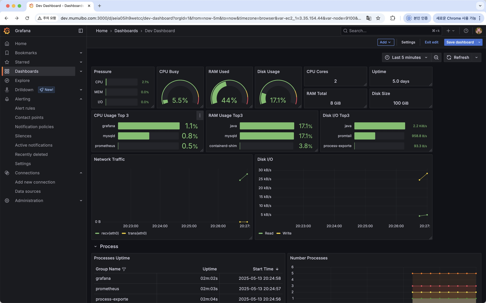

## Monitoring Service

 Grafana, Prometheus, Loki, Promtail, node-exporter, process-exporter 등을 활용하여 시스템 상태, 리소스 사용량, 서비스 로그 및 알림을 통합 관리합니다.
 
 ### ✅ 구성 요소

| 구성요소          | 설명                 |
----------------------|-------------------------------------------------|
| **Prometheus**          | Node/Process Exporter 메트릭 수집                 |
| **Grafana**             | 수집된 메트릭 시각화 및 alert 설정                    |
| **Node Exporter**       | CPU, Memory, Disk, Network 등 시스템 리소스 수집    |
| **Process Exporter**   | 주요 프로세스 별 리소스 사용량 수집                     |
| **Loki + Promtail**     | 서비스 로그 수집 및 분석                             |

### 🔗 Grafana 접속 방법 (API-Gateway 에서 라우팅 완료 후 수정 예정) 
	•	접속 URL: http://dev.mumulbo.com:3000
	•	기본 계정: admin / admin
 	•	팀원 별 계정: (ACE ID) / (ACE ID)
	•	로그인 후 데이터소스 및 대시보드 자동 로딩됨

